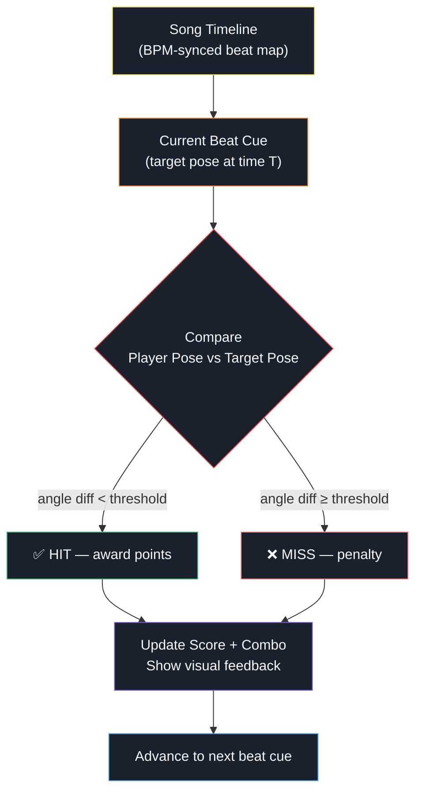

# Analysis of `gesture.py` & `pyglem.py`

---

## 1. High-Level Overview

### [`gesture.py`](file:///d:/RADIT%20Files/code/py/gesture.py) — Computer Vision Input Layer

This file is a **real-time hand-tracking module** built on OpenCV and MediaPipe. Its sole job is to capture webcam frames, detect a single left hand, and expose the palm-center position as two global variables (`x`, `y`).

| Aspect | Detail |
|---|---|
| **Tracking Target** | Single left hand, palm center (landmark: `MIDDLE_FINGER_MCP`) |
| **Output** | Global `x` (0–1280 px) and `y` (0–720 px, Y-flipped for screen coords) |
| **Entry Point** | `Update()` — meant to be called every frame from the game loop |
| **Cleanup** | `CleanGesture()` — releases the webcam |

### [`pyglem.py`](file:///d:/RADIT%20Files/code/py/pyglem.py) — Lightweight Game Framework (Wrapper around Pyglet)

This file is a **mini game-engine abstraction layer** built on top of [Pyglet](https://pyglet.org/). It wraps windowing, sprite management, and the game loop into a clean, simplified API. The name "Pyglem" is a portmanteau of **Pyg**let + e**lem**ent.

| Aspect | Detail |
|---|---|
| **Windowing** | Creates a Pyglet window with configurable resolution, FPS, title, fullscreen |
| **Sprite System** | `Sprite` class with load, draw/undraw, position, scale, rotation |
| **Rendering** | A global `SpritePool` that batch-draws every registered sprite each frame |
| **Game Loop** | Decorator-based `@OnUpdate` registers a user update function; `Run()` starts the event loop |

---

## 2. Architecture & Data Flow

```mermaid
graph LR
    A["Webcam<br/>(cv2.VideoCapture)"] -->|frame| B["gesture.py<br/>Update()"]
    B -->|MediaPipe<br/>Hand Detection| C["Global x, y"]
    C -->|"import gesture<br/>gesture.x, gesture.y"| D["Main Game Script"]
    D -->|"sprite.x = gesture.x<br/>sprite.y = gesture.y"| E["pyglem.py<br/>SpritePool"]
    E -->|"on_draw() batch render"| F["Pyglet Window<br/>(OpenGL)"]

    style A fill:#2d3748,stroke:#4fd1c5,color:#e2e8f0
    style B fill:#2d3748,stroke:#f6ad55,color:#e2e8f0
    style C fill:#2d3748,stroke:#fc8181,color:#e2e8f0
    style D fill:#2d3748,stroke:#b794f4,color:#e2e8f0
    style E fill:#2d3748,stroke:#68d391,color:#e2e8f0
    style F fill:#2d3748,stroke:#63b3ed,color:#e2e8f0
```



### How They Communicate — Shared Global State

The two modules talk through the **simplest possible IPC mechanism: shared global variables in a single Python process.**

A hypothetical `main.py` would look like this:

```python
import gesture
import pyglem

pyglem.InitPyglem(1280, 720, fps=60, title="My Game")

cursor = pyglem.Sprite()
cursor.Load("cursor.png", pyglem.AnchorX.Center, pyglem.AnchorY.Center)
cursor.Draw()

@pyglem.OnUpdate
def update(dt):
    gesture.Update()           # 1. grab a webcam frame & run MediaPipe
    cursor.x = gesture.x      # 2. read the tracked hand position
    cursor.y = gesture.y      # 3. move the sprite to match
    
pyglem.Run()                   # 4. start the Pyglet event loop
```

### Why This Doesn't Freeze the Screen

| Concern | How It's Handled |
|---|---|
| **Blocking camera reads** | `cap.read()` on a USB webcam typically completes in 1–5 ms. At 60 FPS the frame budget is ~16.7 ms, so a single synchronous read usually fits. |
| **MediaPipe inference** | `hands.process()` runs a lightweight TFLite model. On a modern CPU it takes ~5–10 ms for a single hand. Still within budget. |
| **No threading needed (yet)** | Since the total CV pipeline (capture + inference) is ~10–15 ms and the rendering side is minimal, everything runs sequentially inside the Pyglet clock tick without dropping frames. |

> [!WARNING]
> This architecture works because `gesture.py` limits to **1 hand** and a small frame. If you switch to **MediaPipe Pose** (33 landmarks, full body), inference can jump to **20–30 ms**. At 60 FPS you'll eat your entire frame budget. You should consider one of these strategies:
> - Drop target FPS to 30 
> - Run pose detection in a **background thread** with a `threading.Lock()` guard
> - Process pose detection every **2nd or 3rd frame** and interpolate between results

---

## 3. Library Breakdown

| Library | Role | Why It Sidesteps the "No Game Engine" Rule |
|---|---|---|
| **`cv2` (OpenCV)** | Webcam capture, image flipping, color conversion. The I/O backbone for the vision pipeline. | It's a *computer vision library*, not a game engine. It handles camera input, not game logic. |
| **`mediapipe`** | Pre-trained ML models for hand/pose/face tracking. Runs inference on each frame to extract landmarks. | It's a *machine learning framework* for perception. No game logic, no scene graph, no physics. |
| **`pyglet`** | OpenGL-based windowing, sprite rendering, event loop, and clock scheduling. | It's a *multimedia library* (like SDL/SFML), not a game engine. There's no built-in physics, scene management, entity system, or editor — you build all that yourself. It's the same tier as Pygame. |
| **`inspect`** | Used internally by pyglem to check if the user's update function accepts a `dt` parameter or not. | Standard library utility. |

> [!NOTE]
> The key distinction: **game engines** (Unity, Godot, Unreal) provide integrated editors, scene graphs, physics engines, audio managers, and scripting runtimes out of the box. Pyglet, Pygame, and similar libraries only provide a **window + draw calls + input events** — you still have to code all game logic, state machines, collision, scoring, etc. from scratch.

---

## 4. Actionable Adaptation — Rhythm Game Strategy

Here's a step-by-step plan for adapting this architecture into a **rhythm/dance game** using MediaPipe Pose:

### Phase 1: Swap Hand Tracking → Full-Body Pose

```diff
- import mediapipe as mp
- mp_hands = mp.solutions.hands
- hands = mp_hands.Hands(max_num_hands=1, ...)

+ import mediapipe as mp
+ mp_pose = mp.solutions.pose
+ pose = mp_pose.Pose(min_detection_confidence=0.7, min_tracking_confidence=0.7)
```

Instead of exposing just `x, y`, export a **dictionary of key body landmarks**:

```python
# gesture.py (adapted)
landmarks = {}   # e.g. {"left_wrist": (x, y), "right_wrist": (x, y), ...}

def Update():
    global landmarks
    success, image = cap.read()
    if not success: return
    
    image = cv2.flip(image, 1)
    image_rgb = cv2.cvtColor(image, cv2.COLOR_BGR2RGB)
    results = pose.process(image_rgb)
    
    if results.pose_landmarks:
        lm = results.pose_landmarks.landmark
        W, H = 1280, 720
        landmarks = {
            "left_wrist":    (int(lm[mp_pose.PoseLandmark.LEFT_WRIST].x * W),
                              int((1 - lm[mp_pose.PoseLandmark.LEFT_WRIST].y) * H)),
            "right_wrist":   (int(lm[mp_pose.PoseLandmark.RIGHT_WRIST].x * W),
                              int((1 - lm[mp_pose.PoseLandmark.RIGHT_WRIST].y) * H)),
            "left_elbow":    (int(lm[mp_pose.PoseLandmark.LEFT_ELBOW].x * W),
                              int((1 - lm[mp_pose.PoseLandmark.LEFT_ELBOW].y) * H)),
            "right_elbow":   (int(lm[mp_pose.PoseLandmark.RIGHT_ELBOW].x * W),
                              int((1 - lm[mp_pose.PoseLandmark.RIGHT_ELBOW].y) * H)),
            # ... add more as needed (hips, knees, ankles for full-body dance)
        }
```

### Phase 2: Add a Threaded Capture Pipeline

Since pose detection is heavier, prevent frame drops:

```python
# gesture.py — add threading
import threading

_lock = threading.Lock()
_landmarks = {}

def _capture_loop():
    global _landmarks
    while _running:
        success, image = cap.read()
        if not success: continue
        image = cv2.flip(image, 1)
        results = pose.process(cv2.cvtColor(image, cv2.COLOR_BGR2RGB))
        if results.pose_landmarks:
            new_lm = _extract_landmarks(results)  # your extraction logic
            with _lock:
                _landmarks = new_lm

def get_landmarks():
    with _lock:
        return dict(_landmarks)

# Start capture thread on module load
_running = True
_thread = threading.Thread(target=_capture_loop, daemon=True)
_thread.start()
```

### Phase 3: Design the Rhythm Game Core Loop



### Phase 4: Implement Pose Comparison (Scoring Engine)

Use **joint angle comparison** instead of absolute positions (this makes it body-size agnostic):

```python
import math

def angle_between(a, b, c):
    """Angle at point B formed by points A-B-C, in degrees."""
    ba = (a[0] - b[0], a[1] - b[1])
    bc = (c[0] - b[0], c[1] - b[1])
    dot = ba[0]*bc[0] + ba[1]*bc[1]
    mag_ba = math.sqrt(ba[0]**2 + ba[1]**2)
    mag_bc = math.sqrt(bc[0]**2 + bc[1]**2)
    if mag_ba * mag_bc == 0: return 0
    cos_angle = max(-1, min(1, dot / (mag_ba * mag_bc)))
    return math.degrees(math.acos(cos_angle))

def score_pose(player_landmarks, target_angles):
    """
    target_angles = {
        "right_elbow": 90,   # target angle in degrees
        "left_elbow": 45,
        ...
    }
    Returns a score from 0.0 to 1.0
    """
    total_diff = 0
    count = 0
    
    joints = {
        "right_elbow": ("right_wrist", "right_elbow", "right_shoulder"),
        "left_elbow":  ("left_wrist",  "left_elbow",  "left_shoulder"),
        # add more joints as needed
    }
    
    for joint_name, target_angle in target_angles.items():
        a_key, b_key, c_key = joints[joint_name]
        if all(k in player_landmarks for k in (a_key, b_key, c_key)):
            actual = angle_between(
                player_landmarks[a_key],
                player_landmarks[b_key],
                player_landmarks[c_key]
            )
            total_diff += abs(actual - target_angle)
            count += 1
    
    if count == 0: return 0.0
    avg_diff = total_diff / count
    # Map: 0° diff → 1.0 score, 45°+ diff → 0.0 score
    return max(0.0, 1.0 - (avg_diff / 45.0))
```

### Phase 5: Build the Beat Map System

```python
# beatmap.py
class BeatCue:
    def __init__(self, timestamp: float, target_angles: dict, label: str = ""):
        self.timestamp = timestamp        # seconds into the song
        self.target_angles = target_angles # {"right_elbow": 90, "left_elbow": 120}
        self.label = label                 # "Arms Up!", "T-Pose", etc.
        self.hit = False

# Example beat map for a song at 120 BPM (0.5s per beat)
SONG_BEATMAP = [
    BeatCue(2.0,  {"right_elbow": 170, "left_elbow": 170}, "Arms Straight"),
    BeatCue(4.0,  {"right_elbow": 90,  "left_elbow": 90},  "Flex Pose"),
    BeatCue(6.0,  {"right_elbow": 170, "left_elbow": 45},  "Point Left"),
    BeatCue(8.0,  {"right_elbow": 45,  "left_elbow": 170}, "Point Right"),
    # ... generated from choreography or designed manually
]
```

### Phase 6: Wire It All Together

```python
# main.py
import gesture
import pyglem
from beatmap import SONG_BEATMAP
import time

pyglem.InitPyglem(1280, 720, fps=30, title="Dance Rhythm Game")

# Load your visual assets
bg = pyglem.Sprite()
bg.Load("assets/stage_bg.png")
bg.Draw()

cue_indicator = pyglem.Sprite()
cue_indicator.Load("assets/pose_silhouette.png", pyglem.AnchorX.Center, pyglem.AnchorY.Center)
cue_indicator.x = 640
cue_indicator.y = 360
cue_indicator.Draw()

score = 0
combo = 0
song_start = None
current_cue_idx = 0

@pyglem.OnUpdate
def update(dt):
    global score, combo, current_cue_idx, song_start
    
    if song_start is None:
        song_start = time.time()
    
    elapsed = time.time() - song_start
    
    # Get latest pose from threaded gesture module
    lm = gesture.get_landmarks()
    
    # Check if current beat cue should be evaluated
    if current_cue_idx < len(SONG_BEATMAP):
        cue = SONG_BEATMAP[current_cue_idx]
        
        if elapsed >= cue.timestamp and not cue.hit:
            accuracy = score_pose(lm, cue.target_angles)
            
            if accuracy >= 0.7:
                score += int(accuracy * 100) * (1 + combo * 0.1)
                combo += 1
                # Show "PERFECT!" / "GREAT!" feedback
            elif accuracy >= 0.4:
                score += int(accuracy * 50)
                combo = 0
                # Show "OK" feedback
            else:
                combo = 0
                # Show "MISS" feedback
            
            cue.hit = True
            current_cue_idx += 1

pyglem.Run()
```

### Summary Checklist

| Step | Action | File(s) |
|------|--------|---------|
| 1 | Replace hand tracking with `mp.solutions.pose` | `gesture.py` |
| 2 | Export a landmark dict instead of bare `x, y` | `gesture.py` |
| 3 | Add `threading.Thread` for non-blocking capture | `gesture.py` |
| 4 | Build angle-based pose comparison functions | `scoring.py` (new) |
| 5 | Design a beat map data structure synced to BPM | `beatmap.py` (new) |
| 6 | Add audio playback via `pyglet.media` | `main.py` |
| 7 | Build HUD: score, combo counter, timing bar | `main.py` + pyglem sprites |
| 8 | Add visual feedback (hit/miss animations) | `main.py` + pyglem sprites |
| 9 | Polish: particle effects, screen shake, transitions | `pyglem.py` extensions |

> [!TIP]
> **Audio sync is critical in a rhythm game.** Use `pyglet.media.Player` for music playback and read its `.time` property for the elapsed song time instead of `time.time()`. This ensures your beat cues stay perfectly synced with the audio even if there are minor frame drops.
